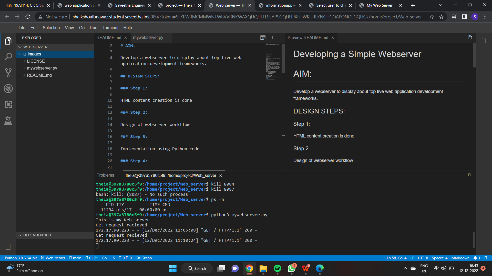
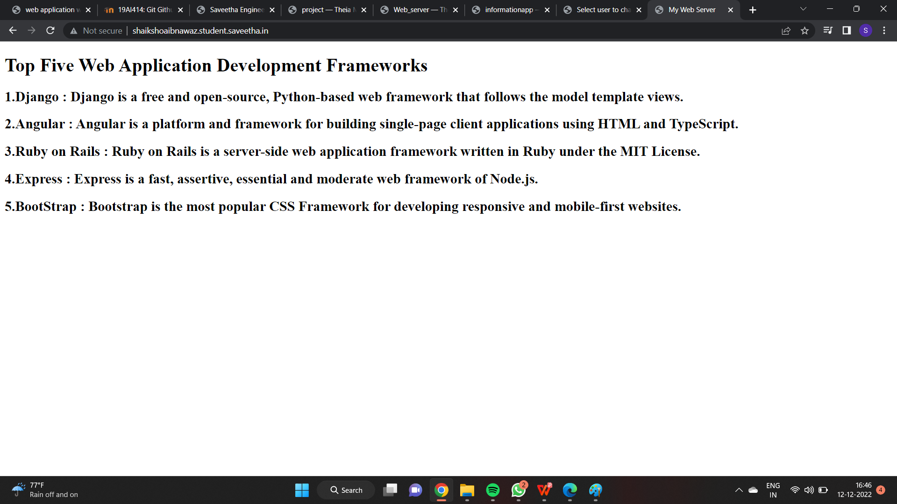

# Developing a Simple Webserver
# AIM:

Develop a webserver to display about top five web application development frameworks.

## DESIGN STEPS:

### Step 1:

HTML content creation is done

### Step 2:

Design of webserver workflow

### Step 3:

Implementation using Python code

### Step 4:

Serving the HTML pages.

### Step 5:

Testing the webserver

## PROGRAM:
```
from http.server import HTTPServer,BaseHTTPRequestHandler
content='''
<!doctype html>
<html>
<head>
<title> My Web Server</title> 
</head>
<body>
<h1>Top Five Web Application Development Frameworks</h1>
<h2>1.Django : Django is a free and open-source, Python-based web framework that follows the model template views.</h2>
<h2>2.Angular : Angular is a platform and framework for building single-page client applications using HTML and TypeScript.</h2>
<h2>3.Ruby on Rails : Ruby on Rails is a server-side web application framework written in Ruby under the MIT License.</h2>
<h2>4.Express : Express is a fast, assertive, essential and moderate web framework of Node.js.</h2>
<h2>5.BootStrap : Bootstrap is the most popular CSS Framework for developing responsive and mobile-first websites.</h2>
</body>
</html>
'''
class MyServer(BaseHTTPRequestHandler):
    def do_GET(self):
        print("Get request recieved")
        self.send_response(200)
        self.end_headers()
        self.wfile.write(content.encode())

print("This is my Web server")
server_address =('',80)
httpd = HTTPServer(server_address,MyServer)
httpd.serve_forever()
```
## OUTPUT:
### Server side output


### Client Side Output


## RESULT:
The program is executed succesfully